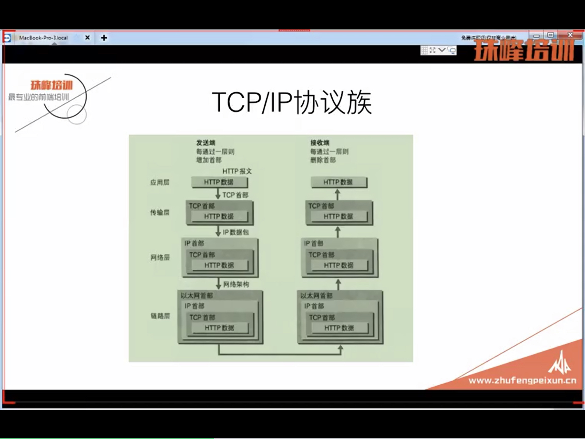
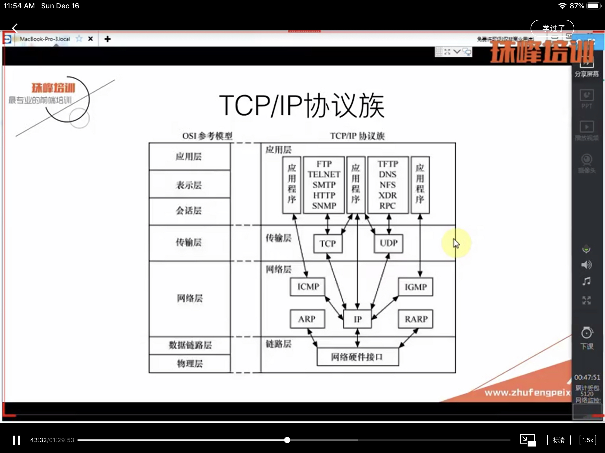
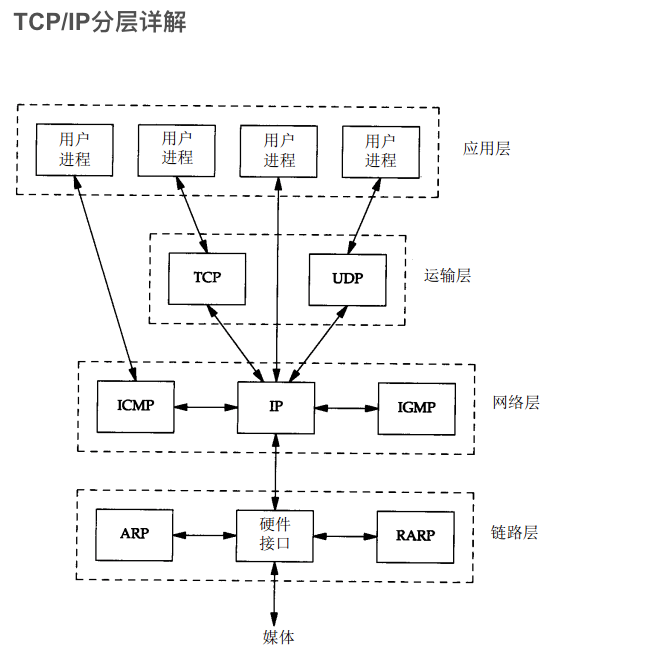

# tcp/ip协议族

## 目标
1. 了解OSI七层模型的意义
  - 物理层：
  - 数据链路层：！以太网
  - 网络层：！ ip
  - 传输层：！ tcp
  - 会话层
  - 表示层：
  - 应用层：！ http / ngix处理的是http / url
2. 了解及ARP协议
3. 了解网络层及IP协议
4. 认清TCP链接的本质
5. 与http结合学习
6. 掌握基本的网络命令
7. 如何实践

## 一些问题
1. 学习tcp/ip协议族有何意义
2. 常见的前端优化理论基础是什么
3. 在时间中可以应用在哪里
4. 现在很多前端开发人员开始接触并应用docker，docker的网络该如何配置
5. https与http的区别，https的意义，js与https
6. http2与http1.1的区别，时间（分析），HTTP（待讨论）
7. http协议（串讲），fetch规范
## 软件开发者关注的网络模型
1. 物理层对于软件开发者不需要太多关注
2. 表示层用于处理数据及安全问题，不需要太多关注
3. 我们关注的四个层次：数据链路层，网络层，传输层以及应用层
4. 我们常说的‘四层’，‘七层’就是分别对应着‘传输层’和‘应用层’在osi中的排序位置，这四层也是tcp/ip协议族的四个层次

## tcp/ip协议族
1. 数据链路层：处理与物理设备交互的具体细节
2. 网络层：数据在网络中的分组传输的，网络层处理分组在网络中的活动
3. 传输：也叫运输层，处理端到端的通讯细节，这里的段指的时（端口与端口）
4. 应用层：处理忘了数据与应用程序的交互细节   
  
   
  
- 每次协议需要实习的功能
  - 将上层传递的数据包装位满足该层协议的数据包
  - 将下层传来的数据解析位满足该层协议的数据包
  - 处理与其他层的交互

## wireshark
1. 7 
